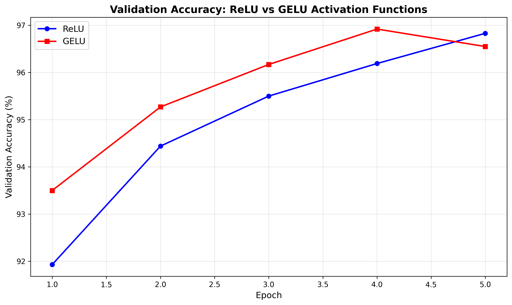

# MNIST Activation Function Comparison: ReLU vs GELU

## Claim

This project compares **ReLU** and **GELU** activation functions on MNIST digit classification using identical feedforward neural networks.

## Setup

**Requirements:**
```bash
pip install torch torchvision matplotlib
```

**Run the experiment:**
```bash
python MNIST.py
```

The script will automatically download MNIST data, train both models, and generate an accuracy comparison graph.

**Model Architecture:**
Both models use identical 3-layer feedforward networks:
- Input: 784 neurons (28×28 flattened images)
- Hidden layers: 128 → 64 neurons
- Output: 10 classes (digits 0-9)
- Training: 5 epochs, Adam optimizer (lr=0.001), batch size 64

## Observations



The graph shows validation accuracy progression over 5 training epochs for both activation functions.

**Training Progression:**
- **Epoch 1**: GELU starts with a significant advantage (93.50% vs 91.93%)
- **Epochs 2-4**: GELU maintains its lead consistently, outperforming ReLU by 0.7-0.8%
- **Epoch 5**: ReLU shows stronger final convergence (96.83%) while GELU slightly dips (96.55%)

**Key Findings:**
- GELU demonstrates better early learning capability
- ReLU shows more stable final convergence
- Both activation functions achieve excellent performance (>96.5%)

## Conclusion

**Final Results:**
- **ReLU**: 96.83% validation, 96.84% test accuracy
- **GELU**: 96.55% validation, 97.19% test accuracy

**Analysis:**
Despite ReLU achieving higher validation accuracy, GELU ultimately performs better on the test set (+0.35%). This interesting discrepancy demonstrates that validation performance doesn't always predict final test results.

**Key Insights:**
- **GELU**: Better early learning and superior test generalization
- **ReLU**: More consistent training dynamics and stable convergence
- **Performance**: Both achieve excellent results (>96.5%), showing minimal practical difference on MNIST
- **Takeaway**: The choice between these activation functions may depend more on training stability preferences than final accuracy for simple tasks

## Limitations

- Single run experiment (no statistical significance)
- Simple dataset (MNIST) and architecture (feedforward)
- Limited training time (5 epochs)
- No computational efficiency analysis

## Future Work

- Test on more complex datasets (CIFAR-10, ImageNet)
- Compare additional activation functions (Swish, Leaky ReLU)
- Run multiple experiments for statistical significance
- Analyze training time and computational overhead

---

*A systematic comparison of ReLU vs GELU activation functions on MNIST classification.*